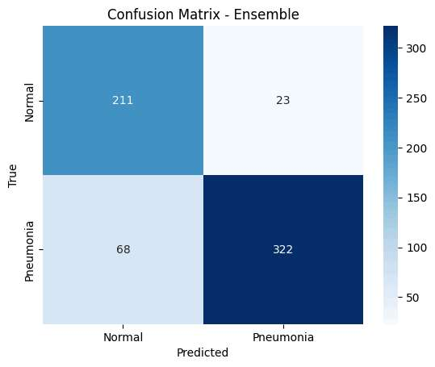
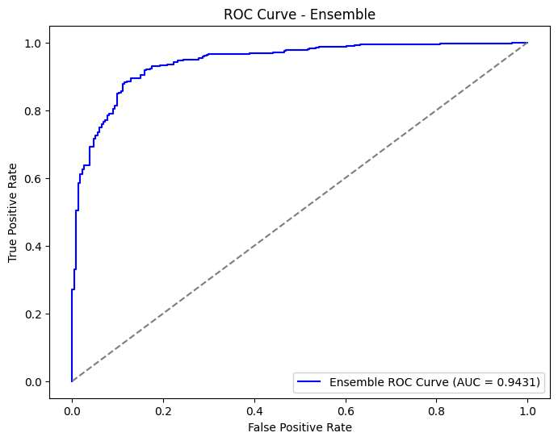
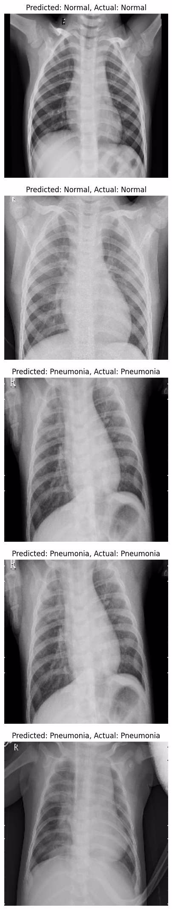

# Pneumonia Detection Using Chest Scans

## Repository: Pneumonia_Detection_CV

This repository contains all the necessary files and resources for the project **Pneumonia Detection Using Chest Scans**. The goal is to develop a robust Computer-Aided Diagnosis (CAD) system using chest X-rays and state-of-the-art deep learning techniques.

---

## Files and Directories

- **CV_Pneumonia_detection.ipynb**: The main Jupyter Notebook containing the implementation of the project.
- **CV_Project_Report.docx**: The detailed project report with methodology, results, and discussions.
- **images/**: A folder containing visual outputs such as:
  - Confusion Matrix.
  - ROC Curve.
  - Sample predictions on chest X-ray images.

---

## Features

- **Automated Pneumonia Detection**:
  - Classifies chest X-rays into pneumonia or normal categories.
- **Deep Learning Models**:
  - Pre-trained CNNs like ResNet-18, DenseNet-121, and GoogLeNet.
- **Ensemble Learning**:
  - Combines individual model predictions for enhanced accuracy.
- **Visualization**:
  - Includes confusion matrix, ROC curve, and sample predictions.

---

## Methodology

1. **Data Collection and Preprocessing**:
   - Dataset: 5,863 pediatric chest X-rays.
   - Preprocessing: Image resizing, normalization, and augmentation.

2. **Model Architecture**:
   - Transfer learning applied to ResNet-18, DenseNet-121, and GoogLeNet.
   - Custom classifier layers added for binary classification.

3. **Training and Optimization**:
   - Loss Function: Binary cross-entropy.
   - Optimizer: Adam with learning rate scheduling and early stopping.

4. **Evaluation**:
   - Metrics: Accuracy, Precision, Recall, F1-score, and AUC.
   - Visualization through confusion matrix and ROC curve.

---

## Results

- **Individual Model Accuracy**:
  - ResNet-18: 73.24%
  - DenseNet-121: 86.38%
  - GoogLeNet: 79.49%

- **Ensemble Model Performance**:
  - Accuracy: 85.42%
  - Classification Report:
    - Normal: Precision - 0.76, Recall - 0.90, F1-Score - 0.82.
    - Pneumonia: Precision - 0.93, Recall - 0.83, F1-Score - 0.88.

### Visualizations

#### Confusion Matrix


#### ROC Curve


#### Sample Predictions


---

## Requirements

To run this project, install the following dependencies listed in **requirements.txt**:

```plaintext
numpy
pandas
matplotlib
seaborn
scikit-learn
tensorflow
keras
jupyterlab
opencv-python
```

---

## How to Run

1. Clone the repository:
   ```bash
   git clone https://github.com/<your-username>/Pneumonia_Detection_CV.git
   ```

2. Navigate to the repository:
   ```bash
   cd Pneumonia_Detection_CV
   ```

3. Install the dependencies:
   ```bash
   pip install -r requirements.txt
   ```

4. Open the Jupyter Notebook:
   ```bash
   jupyter lab CV_Pneumonia_detection.ipynb
   ```

5. Follow the notebook instructions to execute the project.

---

## References

- [Kermany et al., 2018](https://doi.org/10.1016/j.cell.2018.02.010): Identifying medical diagnoses and treatable diseases by image-based deep learning.
- [He et al., 2016](https://doi.org/10.1109/CVPR.2016.90): Deep residual learning for image recognition.
- [Huang et al., 2017](https://doi.org/10.1109/CVPR.2017.243): Densely connected convolutional networks.
- [Szegedy et al., 2015](https://doi.org/10.1109/CVPR.2015.7298594): Going deeper with convolutions.

---

## License

This project is licensed under the MIT License. See the LICENSE file for details.
